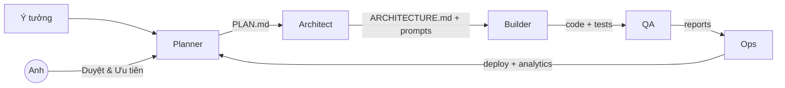

# AI Foundation — All-in-One (Lite)

Phiên bản đầy đủ nhưng gọn nhẹ, chỉ tập trung vào **tài liệu nền móng & quản trị**.

## Sơ đồ pipeline


## Thành phần chính
- Tài liệu nền móng: Charter, Roles, RACI, Plan, Architecture, Testing, Progress
- File bổ sung: Data Dictionary, Experiment Log, Model Card, KPI Dashboard
- Quản trị: CODEOWNERS, RoleGuard, CI/CD cơ bản, Issue/PR templates

## Cách dùng nhanh
```bash
unzip ai-foundation-all-in-one.zip
cd ai-foundation-all-in-one

# (tuỳ chọn) bật RoleGuard hooks
git config core.hooksPath .githooks
chmod +x .githooks/pre-commit
```
